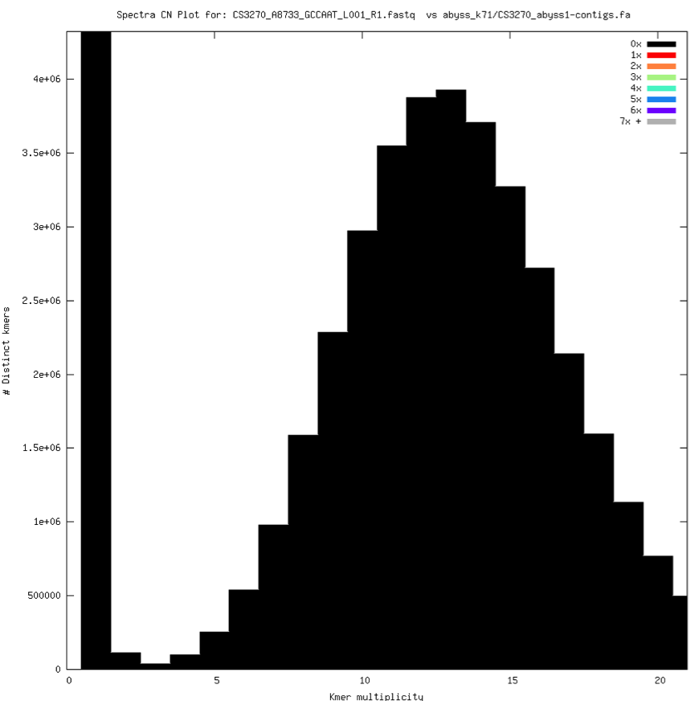
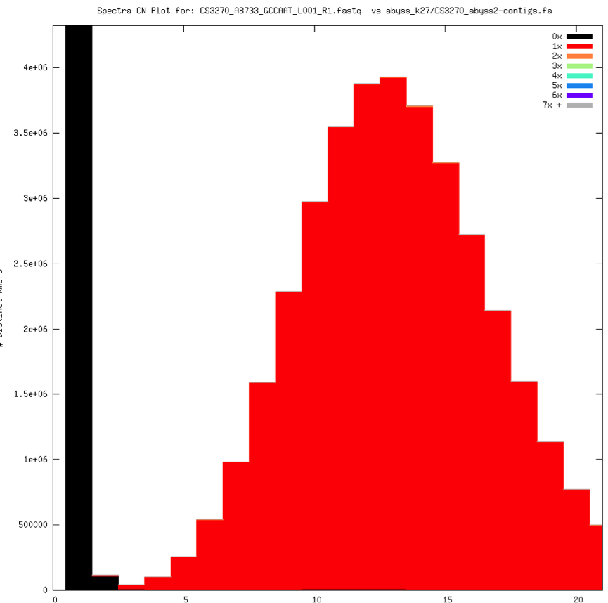

Key Learning Outcomes
---------------------

After completing this module the trainee should be able to:

-   Assess general assembly approach, kmer spectra and biases.

-   Visually inspect the kmer spectra and KAT plots

-   Run a first pass eukaryotic assembly and do goal checks

-   Develop validation metrics or tools for NGS data and assembly.

-   Improving methods and pipelines for genome assembly.

-   Convince the lab guys to tweak protocols.

Resources You’ll be Using
-------------------------

### Tools Used

Kmer Analysis Tool kit:    
    <https://github.com/TGAC/KAT>

Nextclip:   
    <https://github.com/richardmleggett/nextclip>

Abyss:   
    <http://www.bcgsc.ca/platform/bioinfo/software/abyss>

Soap Denovo:   
    <http://soap.genomics.org.cn/soapdenovo.html>

SOAPec:   
    <http://soap.genomics.org.cn/about.html>

BLAST:   
    <http://blast.ncbi.nlm.nih.gov/Blast.cgi>

First Pass Genome Assembly
--------------------------

Assuming by now you are familiar with the general concept of *de novo*
assembly, kmers and the de Bruijn graph based assembler. In this
tutorial we will use ABySS to perform the first pass assembly of a
eukaryotic genome and look at various parameters to assess the
information content of the input data and choice of assembly parameters.
sequence data.\
Genome assembly is a challenging problem requiring heavy computational
resources, expertise and time. Before you beging the process of denovo
assembly there are a number of points you need to consider:

What is the objective of your assembly experiment? What biological
question(s) you have?

Is assembly strictly neccessary for the purpose in question?

Do you have right kind of data and enough coverage to start with?

Do you have suitable computaitonal resources to run this assembly?

Remember that the assembly is just a probabilistic model of a genome,
condensing the information from the experimental evidence. All the
information is already present in the experimental results. The goal of
the assembly is to find the right motifs, the correct number of times,
in correct order and position.

### Fusarium first pass with a goal

Goal: Identify a fusarium sample is \`\`closer" to *F. graminearum* or
*F.pseudograminearum*

-   Previous knowledge

    -   *F. graminearum* has a cluster producing PKS6 and NRSP7, while
        *F. pseudograminearum* produces PKS40 and NRPS32

-   Data

    -   Proteins sequences for:

        -   *F. graminearum* (non necrotrophic): PKS6 and NRSP7

        -   *F. pseudograminearum* (necrotrophic): PKS40 and NRPS32

-   Strategy:

    -   Check PKS6-NRSP7 and PKS40-NRPS32 cluster presence.

-   Assembly goals:

    -   Assembly goal (I): to capture a good enough representation of
        the protein-coding space to get blast matches

    -   Assembly goal (II): to accurately represent the relevant whole
        cluster loci in a single sequence.

Prepare the Environment
-----------------------

Open the Terminal. First, go to the right folder, where the data are
stored.

    cd /home/trainee/eukaryotic
    ls

Task1.1: First pass assembly, k=71
----------------------------------

Let’s assemble *Fusarium* with abyss, k=71

    cd /home/trainee/eukaryotic
    mkdir abyss_k71
    cd abyss_k71
    abyss-pe in="../CS3270_A8733_GCCAAT_L001_R1.fastq ../CS3270_A8733_GCCAAT_L001_R2.fastq" k=71 name=CS3270_abyss_k71 np=4 > CS3270_abyss_k71.log 2>&1

Description of the arguments used in the command:

k :   = kmer size

np :   = number of processors to be used

sequence file names :   = R1 and R2 reads of a paired end sequence data

Let’s look at the statistics of the assembly we just did...

Ok, there is no stats available in the folder, but we can always use
`abyss-fac` to get the stats:

    abyss-fac CS3270_abyss_k71-*tigs.fa  | tee CS3270_abyss_k71-stats.tab
    less CS3270_abyss_k71-stats.tab

|**n** | **n:500** | **L50** | **min** | **N80**| **N50**| **N20**| **E-size**| **max** | **sum**| **name**|
|:----:|:-------:| :-----:| :----: | :----: |:----| :--------:|:------: |:-------: |:-------: |:-------: |
|27 | 13 | 2 | 970 | 6004 | 13202 | 52602 | 28712 | 52602 | 112849 | CS3270\_abyss\_k71-unitigs.fa|
|5 | 1 | 1 | 128429 | 128429 | 128429 | 128429 | 128429 | 128429 | 128429 | CS3270\_abyss\_k71-contigs.fa|

[tab:fusariumk71]

!!! note "Question"
    How many unitigs/contigs do you have in the assembly?\

!!! success ""
    ??? "**Answer**"
    27/5

!!! note "Question"
    What are the length statistics of your assembly? 
!!! success ""
    ??? "**Answer**"
    in the table above

!!! note "Question"
    Does it match what you think before the assembly and why?\

!!! success ""
    ??? "**Answer**"
    No

The assembly is looking strange! It’s time for some analysis:

Check frequencies for kmers kept/discarded/etc.

Check spectra-cn and compare with expectations. Let’s do this by the
following commands:

    less CS3270_abyss_k71.log 
    less coverage.hist

We will now plot the values from the `coverage.hist`:

    gnuplot <Press enter>
    gnuplot> set xrange [0:200]
    gnuplot> set yrange [0:5000]
    gnuplot> plot "coverage.hist"
    Type exit or quit to leave the gnuplot
    gnuplot> exit

Looks like we are not assembling this bit, let’s have another look at
the spectra

    kat comp -o reads_vs_abyss_k71 -t 4 -C -D --d1_bins 2000 '../*.fastq' CS3270_abyss_k71-contigs.fa

Description of the arguments used in the command:

o
:   = Path prefix for files generated by this program.

t
:   = The number of threads to use.

C
:   = Whether the jellyfish hash for input 1 contains K-mers produced
    for both strands

D
:   = Whether the jellyfish hash for input 2 contains K-mers produced
    for both strands

–d1\_bins
:   = Number of bins for the first dataset. i.e. number of rows in the
    matrix

<!-- -->

    kat plot spectra-cn -y 600 -x 2000 -o reads_vs_abyss1-main.mx.spectra-cn_2000.png reads_vs_abyss_k71-main.mx

Description of the arguments used in the command:

x
:   = Maximum value for the x-axis (default value auto calculated from
    matrix, otherwise 1000)

y
:   = Maximum value for the y-axis (default value auto calculated from
    matrix if possible, otherwise, 1000000)

o
:   = The path to the output file

The kmer spectra for *Fusarium* assembly with abyss, k=71 should be
looking like this:

[H]  [fig:fusariumk71]

Take the output and BLAST it in NCBI. What is it? Surprising?

Choosing a wrong k value (too large in this case) and just running a
typical assembly job, we can end up with something quite more
interesting. It is easy by comparison to spot some missing content,
alongside duplications and triplications (and quadruplications and so
on) that should not be there. This assembly will get us nowhere, let’s
choose a lower K to gain coverage and start again.

Task1.2: First pass assembly, k=27
----------------------------------

We now assemble *fusarium* with `abyss` and k=27:

    cd /home/trainee/eukaryotic
    mkdir abyss_k27
    cd abyss_k27
    abyss-pe in="../CS3270_A8733_GCCAAT_L001_R1.fastq ../CS3270_A8733_GCCAAT_L001_R2.fastq" k=27 name=CS3270_abyss_k27 np=4 > CS3270_abyss_k27.log 2>&1

Let’s look at the stats by doing:

    less CS3270_abyss_k27-stats.tab

Stats look better:

|**n** | **n:500** | **L50** | **min** | **N80**| **N50**| **N20**| |**E-size**| **max** | **sum**| **name**|
|:----:|:-------:| :-----:| :----: | :----: |:----| :--------:|:------: |:-------: |:-------: |:-------: |
|30645 | 2717 | 430 | 502 | 11354 | 25336 | 47966 | 31027 | 147694 | |36.14e6 | CS3270\_abyss\_k27-unitigs.fa|
|21511 | 350 | 33 | 527 | 157565 | 338989 | 630228 | 407098 | 1265237 | |36.52e6 | CS3270\_abyss\_k27-contigs.fa|
|21327 | 205 | 17 | 527 | 332444 | 716132 | 1265237 | 791882 | 1880850 | |36.51e6 | CS3270\_abyss\_k27-scaffolds.fa|

[tab:fusariumk27]

Let’s check a bit anyway:

    less CS3270_abyss_k27.log
    less coverage.hist

How is the coverage plot looking now?

    gnuplot
    gnuplot> set xrange [0:50]
    gnuplot> set xrange [0:4000000]
    gnuplot> plot "coverage.hist"
    gnuplot> exit

K-mer spectrum:

    kat plot spectra-cn -y 1000 -x 1000 -o reads_vs_abyss1-main.mx.spectra-cn_noabsent.png reads_vs_abyss1-main.mx
    kat comp -o reads_vs_abyss_k27 -t 4 -C -D '../*.fastq' CS3270_abyss_k27-scaffolds.fa

[H]  [fig:fusariumk27]

!!! note "Question"
    Any tools you can use to check kmer spectra at any K before assembling?
!!! success ""
    ??? "**Answer**"
    KAT

!!! note "Question"
    Can you predict what will happen if you use KAT with larger K values?\

!!! note "Question"
    Will the assembly answer the biological question?

Use BLAST or BLAT and the databases to check...

    makeblastdb -in CS3270_abyss_k27-scaffolds.fa -dbtype nucl
    blat –t=dnax –q=prot –minIdentity=90 CS3270_abyss_k27-scaffolds.fa test_genes.fasta out.psl

References
----------

1.  De novo genome assembly: what every biologist should know Nature
    Methods 9, 333 – 337 (2012) doi:10.1038/nmeth.1935

